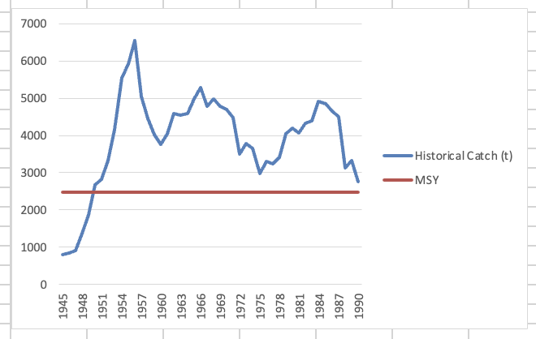

# FAS6355C Fisheries Management Biomass Dynamics Lab

### Marcel Gietzmann-Sanders

## (1) Calculate CPUE. Plot effort and catch over time and catch against effort - what do these graphs tell you about the fishery and the data?

Our effort curve shows a steady increase in the amount of effort going into the fishery year after year. However the catch does not have this kind of clear monotonic increase - intead it just wobbles around a mean (~4000). This is reflected in the CPUE over time curve that shows that it is taking more and more effort to catch the same number of lobsters. In general we can conclude that the biomass in the fishery is getting reduced over time thereby making it more and more difficult to catch these lobsters. 

# Fox

## (2) Fit the model and check the fit graphically

## (3) What is your assessment of the status of the fishery at the end of the data series (in 1990)?

$E_{MSY}\approx 2000$ in this example and in 1990 the fishing effort is $\approx 5000$. Furthermore the MSY itself is $\approx 2500$ and the catch is $\approx 2700$. Therefore we are clearly in a state of overfishing. 

Likewise the biomass at equilibrium for MSY is $\approx 42000$ (t) whereas the 1990 biomass estimate is $\approx 20000$ (t). Therefore our stock is also overfished. 

## (4) Compare historical catches with estimated MSY. How do the historical and equilibrium catches compare? Why?

Clearly the historic catches are above MSY and equilibrium catch. It seems this has remained consistent for so long just given how exceptionally large the biomass was to begin with. As a result this fishery has been able to dig into that original biomass for a very long time but as we noted in the last section, this has led to the stock being in an overfished state.

## (5) Explore what would happen to the stock and the fishery given different assumptions about future effort. If effort was restricted to $E_{MSY}$, what effect would that have on stock biomass and catches over time?

