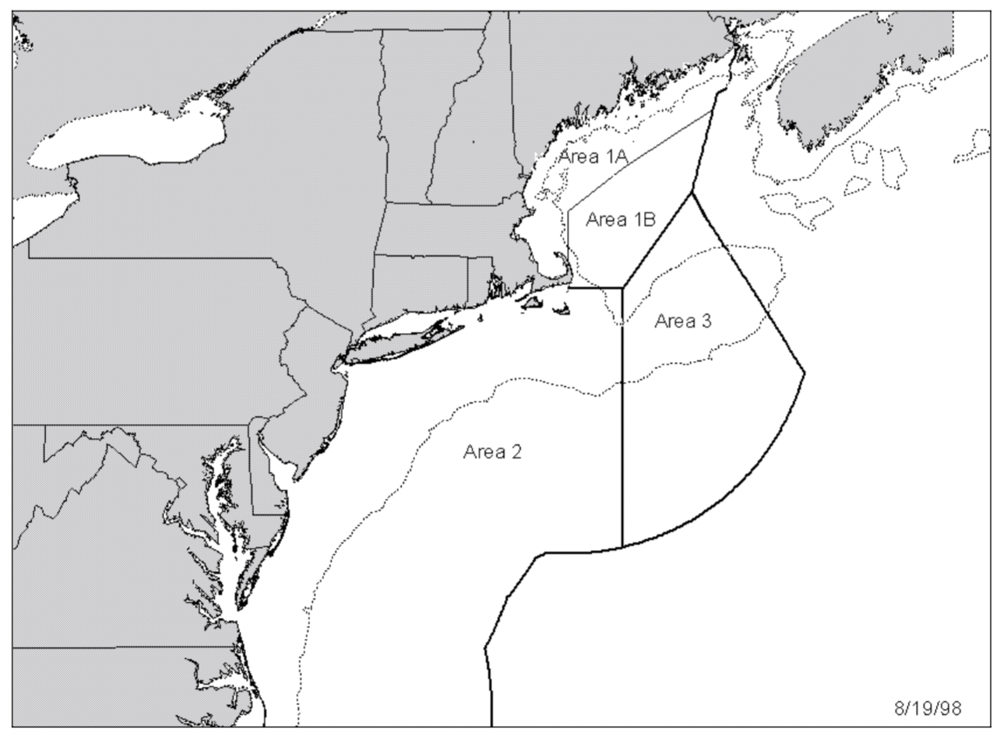
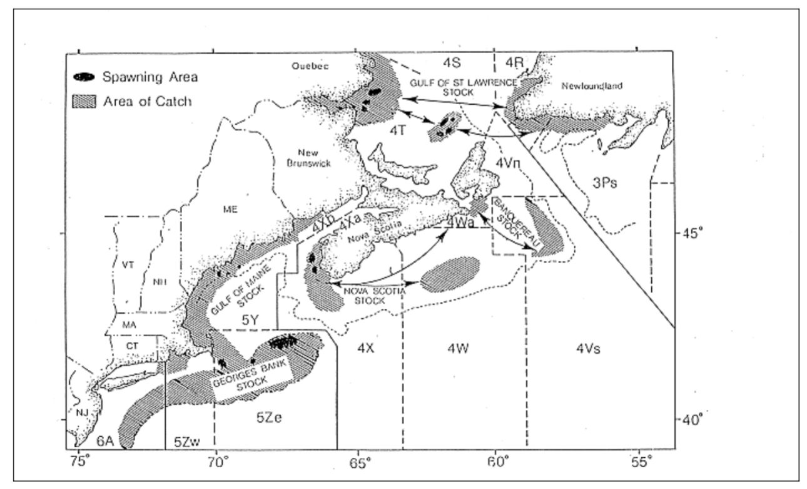
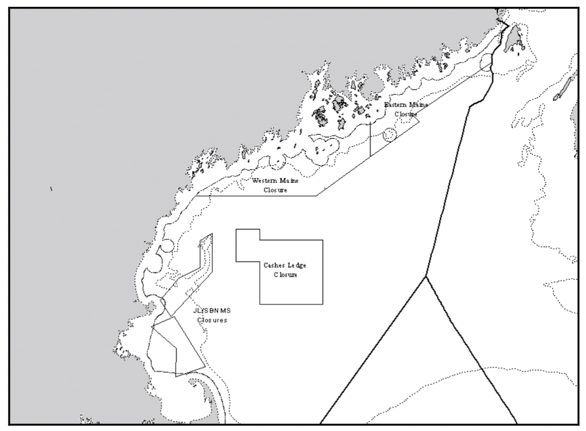
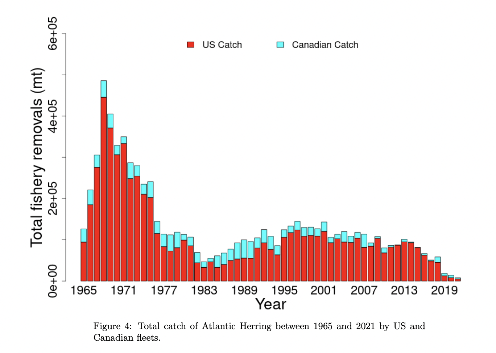

# The Fishery Itself

## The Resource 
The Atlantic Herring Fishery deals in [*Clupea harengus*](https://www.fisheries.noaa.gov/species/atlantic-herring) along the Atlantic coast of the United States. The range of the fishery extends from the Gulf of Maine down to the Carolinas[[1]](https://www.fisheries.noaa.gov/management-plan/atlantic-herring-management-plan) while the range of the species itself extends up into Canada as well. 

The species is highly migratory with at least three phases present[[1]](https://www.fisheries.noaa.gov/management-plan/atlantic-herring-management-plan).

> (1) a late summer-early autumn spawning migration of ripening fish; (2) a rapid post-spawning migration to warmer waters to the south for overwintering; and (3) a spring-early summer feeding migration.

Spawning is especially interesting in Atlantic herring. First there seems to be some kind of "homing" behavior with herring:

>a tagging study in Newfoundland which showed that adult Atlantic herring returned to the same spawning grounds year after year (Wheeler and Winters 1984).[[1]](https://www.fisheries.noaa.gov/management-plan/atlantic-herring-management-plan)

When they do aggregate to spawn, eggs are laid en masse on the seafloor where they are subjected to heavy predation pressure. Larvae then hatch and overwinter in coastal and estuarine waters. 

These larvae are a source of food for many marine animals, are very much at the will of their environment, and therefore can experience quite high mortality[[1]](https://www.fisheries.noaa.gov/management-plan/atlantic-herring-management-plan).

All in all the density of these spawning clusters and the subsequent vulnterability of the larvae make herring very sensitive to spawning success and given aggregations are easy to fish spawning closers have been implemented in several states.

Predation is another big vulnerability for herring as they are a food fish for many different species of marine mammal, fish, and bird. 

>Overholtz et al. (1991) also calculated that five species of whales, three species of dolphins, harbor porpoises and harbor seals consumed, on average, 19,300 mt (42.5 million lbs) of herring a year from 1988-92

>These calculations indicate that between piscivorous fish, marine mammals and marine birds, approximately 30,000 mt of herring is consumed each year. This is probably an underestimate since it was based among other things, on a presumed low abundance of herring on Georges Bank and herring, at least during the spawning season, are known to be much more abundant in recent years as the offshore portion of the stock has recovered. However, even using an estimate of 50,000 mt, this only represents 2.5% of the estimated total stock size of Atlantic herring in 1990, and 50% of the current commercial harvest.[[1]](https://www.fisheries.noaa.gov/management-plan/atlantic-herring-management-plan) 

Given the uncertainty in these estimates and the magnitude of the predation natural mortality is even greater consideration for herring when considering such quanities as MSY. 

In terms of environmental factors affecting the resource much of this appears to be affects on spawning and the larval ages of stocks:

> Mortality of Atlantic herring in the larval stage is very high since the larvae remain vulnerable to very low temperatures and a limited food supply for a prolonged period during the winter, especially in the shallow nearshore and estuarine waters (Townsend and Graham 1981, Graham et al. 1991). Campbell and Graham (1991) developed an ecological model in order to examine which factors affected larval survival to the early juvenile stage.[[1]](https://www.fisheries.noaa.gov/management-plan/atlantic-herring-management-plan) 

While temperatures in the Gulf of Maine are increasing faster than many other parts of the world[[2]](https://www.fisheries.noaa.gov/new-england-mid-atlantic/ecosystems/current-conditions-northeast-us-shelf-ecosystem-spring-2022) this in combination with runoff is also creating eutrophication[[3]](https://www.gulfofmaine.org/public/state-of-the-gulf-of-maine/eutrophication/) which can starve estuarine areas of oxygen and nutrients. All in all I think its pretty unclear how environmental changes are affecting herring but they are certainly sensitive to these kinds of changes. 

Over its history this stock has had quite large swings in estimated abundance with a notable crash in the 1970s, a recovery after that, and then a crash again recently[[4]](https://apps-st.fisheries.noaa.gov/sis/docServlet?fileAction=download&fileId=8051).

## Technical Attributes of Fishing

Herring are primarly caught by commercial fishers using purse seines and mid water trawls although gillnetting and fixed gear such as weirs are allowed and sometimes used[[5]](https://www.fisheries.noaa.gov/species/atlantic-herring#overview). There are no minimums set on gear sizes and mid water trawls are known to be reasonably selective[[6]](https://www.msc.org/docs/default-source/default-document-library/education-page/msc---fishery-factsheet-atlantic-herring.pdf?sfvrsn=d229b7c_6) and thereby limit harvesting of bycatch. NOAA also notes[[5]](https://www.fisheries.noaa.gov/species/atlantic-herring#overview):

>The Atlantic herring fishery can incidentally catch marine mammals. Currently, these takes are below limits that would require mitigation under the Marine Mammal Protection Act.

While there are no limits on gear size juveniles of age 2 are taken as sardines while smaller juveniles are typically not captured[[1]](https://www.fisheries.noaa.gov/management-plan/atlantic-herring-management-plan). 

>Vessels fishing for herring that are less than 165 feet in length overall, less than 750 gross registered tons, or less than 3,000 shaft horsepower may be issued one of the herring permits listed below. Herring vessels exceeding the size and horsepower restrictions may be issued a herring at-sea processing permit.[[7]](https://www.fisheries.noaa.gov/species/atlantic-herring#commercial) 

In 2014 there were ~2000 permits recorded for fishing Atlantic Herring[[8]](https://www.fisheries.noaa.gov/permit/atlantic-herring) however it has been noted in the past that the vast majority of fish are caught by a minority of boats:

>The fishery is dominated by a relatively small group of vessels, though a broader group of vessels lands some herring in small amounts (Table E.14). In 1997, nearly 98 percent of the landings were made by 21 vessels, and 10 boats accounted for 92% of the catch. This same year, only 61 vessels averaged more than 2,000 pounds of herring on trips that reported landing herring.[[1]](https://www.fisheries.noaa.gov/management-plan/atlantic-herring-management-plan)

Finally in terms of history of the resource:

>Historically, Gulf of Maine herring were harvested along the coast in fixed-gear weirs (a fence of long stakes driven into the ground with nets arranged in a circle). Today, herring are primarily harvested by mid-water trawlers and purse seiners.[[5]](https://www.fisheries.noaa.gov/species/atlantic-herring#overview)

## Enhancement
There does not seem to be any enhancement procedures in place for this fishery.

## Habitat, environment, and ecosystem

Some of this has already been mentioned above in [The Resource](#the-resource). Atlantic herring range from coastal areas along the east coast of North America from the Canadian maritime provinces down to the Carolinas and extend out to George's Bank. There are also populations in other parts of the atlantic (there are European fisheries). 

Herring do not exist throughout their range in large numbers at all times but instead migrate up and down latitudes throughout the year. They overwinter in warmer waters down south, move up north to feed in the spring, and then aggregate and spawn in the north during the late summer and fall. 

Their spawning aggregations are relatively small in spatial extent making them quite vulnerable during spawning. 

While the range does extend into Canada the majority of the catch is taken by the United States making enforcement and management of the resource far easier. 

Their eggs are laid in mass and experience heavy predation pressure before hatching 10 or so days later. The larvae then overwinter near their spawning grounds along the coasts or in estuaries where they continue to experience significant predation pressure and depend on warm enough temperatures and good sources of food to not die off en masse. 

After over wintering they then recruit to the overall population and are sometimes caught as sardines. 

Herring are a food fish for a wide variety of different animals including (but not limited to) seabirds, groundfish such as cod, whales, and seals. The predation from these species seems to be comparable to the fish pressure exerted by humans. 

While temperatures are warming throughout their range and it is well understood that herring juveniles and their prey are affected by these kinds of changes[[9]](https://academic.oup.com/plankt/article/44/3/401/6562678) it's still not well understood whether these changes are having positive or negative changes. 

There are however significant changes in estuarine and coastal environments simply due to runoff and other kinds of pollution. And this almost always causes negative changes to juvenile fish. 

## Stakeholders

The herring fishery captures herring primarly for canning and use as bait with some more artisinal uses as smoked goods or fresh fillets. Therefore there is a whole chain of stakeholders beginning with the fishermen themselves, moving onto the trucks who move the fish from dock to canneries (or other processors), the processors themselves, and then of course the consumer at the end of the line (which in the case of bait for things like lobster, tuna, etc means other fishermen)[[1]](https://www.fisheries.noaa.gov/management-plan/atlantic-herring-management-plan).

>The herring is typically pumped into trucks that carry a combined mixture of herring and water, but are not cooled in any manner. For this reason, it is important the fish be landed soon after they are caught and transported as rapidly as possible. The typical truck is estimated to hold about 40,000 pounds (or just under 20 mt) of herring.[[1]](https://www.fisheries.noaa.gov/management-plan/atlantic-herring-management-plan)

So much for primary stakeholders. In terms of secondary stakeholders there are several. The Atlantic States Marine Fishery Council (ASMFC) is ultimately responsible for managing the stock[[10]](https://www.asmfc.org/species/atlantic-herring) but because the stocks extend into state waters they work closely with the New England Fishery Management Council[[11]](https://www.nefmc.org/management-plans/herring). Both of these groups divide into a whole slew of committees and advisory groups who manage everything from the science to the enforcement and everything in between. In addition NOAA advises and provides support for much of the science and management decisions[[1]](https://www.fisheries.noaa.gov/management-plan/atlantic-herring-management-plan). NOAA also seems to provide enforcement for federal waters[[12]](https://www.fisheries.noaa.gov/about/office-law-enforcement). States management enforcement in their own waters (up to 3 miles offshore). 

Finally there are a variety of other stakeholders present from conservation organizations like the Pew Trusts[[13]](https://www.pewtrusts.org/en/research-and-analysis/articles/2018/09/20/atlantic-herring-desperately-need-a-control-rule-to-help-support-the-marine-ecosystem) and Save the Bay in RI[[14]](https://savebay.org/save-bay-works-toward-sustainable-atlantic-herring-fishery/) to those interested in leaving enough food for the marine species that feed on herring[[10]](https://www.asmfc.org/species/atlantic-herring). 

The stakeholders are quite heterogenous but it seems everyone is quite engaged and management is certaintly being kept up to date. Primary stakeholders are clearly largely commercial with little to no one taking home herring for personal use besides use as bait in certain cases. 

