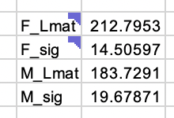

# Testing for Differences in Length at Maturity

Data for this laboratory are from white grunt Haemulon plumieri, a popular reef fish in the Gulf of Mexico.  Data were provided by Dr. Debra Murie. Fish maturity was determined by histology based on headboat collections from Tampa Bay, Florida.

```{r}
setwd("/workspaces/schooling/population_dynamics/lab_5/")
data <- read.table("data/size_mat.txt", header=T, sep="")
head(data)
```

The objectives of this laboratory are:

1.	Identify whether size at maturity differs between male and female white grunt.
2.	Explore using a logistic regression to model binomial data.

## 1. Plot the variable “MAT”, which is maturity (0 = immature, 1 = mature), against maximum total length (MTL) for each sex (use either program).

```{r}
colnames(data) <- tolower(colnames(data))
females <- data[data$sex=="female",]
males <- data[data$sex=="male",]
```

```{r}
plot(
  females$mtl, 
  females$mat,
  xlab="Maximum Total Length (mm)",
  ylab="Maturity (0=immature, 1=mature)",
  main="White Grunt Maturity",
  col=rgb(red = 0, green = 0, blue = 1, alpha = 0.1),
  pch = 19,
  ylim=c(0,1.1)
)
points(
  males$mtl, 
  males$mat+0.1,
  col=rgb(red = 1, green = 0, blue = 1, alpha = 0.1),
  pch = 19
)
legend(x=110, y=1, pch=19, legend=c("Female", "Male+0.1"), col=c("blue", "red"))
```

### Are there any observable differences evident between sexes? 

- Some males reach maturity at a lower length than females.
- However males stay immature to longer lengths as well.
- So I suppose there is just more variation in time to maturity in males. 

## 3. 	Estimate $L_{mat}$ (length at 50% maturity) and $\sigma$ (the steepness of the curve) for each sex by: 1) Inputting starting values for $L_{mat}$ and $\sigma$; 2) Calculating the log likelihood of the binomial distribution for each data point, and then sum those to obtain the total log likelihood of all the data; 3) Maximizing the sum of the log-likelihoods by solving for the $L_{mat}$ and $\sigma$ parameters for each sex using Solver in Excel and optim in R. 

### Report $L_{mat}$ and $\sigma$ for each sex.



### Do the predictions of length at maturity differ between sexes? 

Yes males have a smaller $L_{mat}$ than the females. And the steepness of their curve is less as well due to the higher $\sigma$.

### What is the minimum predicted length of a fully mature fish (p > 0.99)?

- Females: $280 mm$
- Males: $275 mm$

## 4. Repeat questions 2 & 3 in R. Answer the same questions in Q3

```{r}
fun <- function(theta) {
    f_lmat50 <- theta[1]
    f_sig <- theta[2]
    m_lmat50 <- theta[3]
    m_sig <- theta[4]

    prob_mat_female <- 1 / (1 + exp(-(females$mtl - f_lmat50) / f_sig))
    prob_mat_male <- 1 / (1 + exp(-(males$mtl - m_lmat50) / m_sig))
    nll_female <- -1*sum(dbinom(females$mat, size=1, prob=prob_mat_female, log=T))
    nll_male <- -1*sum(dbinom(males$mat, size=1, prob=prob_mat_male, log=T))
    return(nll_female + nll_male)
}
```

```{r}
theta <- c(200, 20, 200, 20)
for (i in 1:10) {
    fit <- optim(theta, fun, hessian=T)
    theta <- fit$par
}
theta
```

The predictions are the same as in Excel. All of the answers to the questions are the same. 

### Using the code used in Lab 2, part 2 for obtaining confidence intervals from the Hessian matrix, report the upper and lower 95% confidence intervals as well.

```{r}
sterr <- sqrt(diag(solve(fit$hessian)))
sterr

ALPHA = 0.05
U_f_lmat50 = theta[1] + qnorm(1-(ALPHA/2)) * sterr[1]
L_f_lmat50 = theta[1] - qnorm(1-(ALPHA/2)) * sterr[1]
U_f_sig = theta[2] + qnorm(1-(ALPHA/2)) * sterr[2]
L_f_sig = theta[2] - qnorm(1-(ALPHA/2)) * sterr[2]
U_m_lmat50 = theta[3] + qnorm(1-(ALPHA/2)) * sterr[3]
L_m_lmat50 = theta[3] - qnorm(1-(ALPHA/2)) * sterr[3]
U_m_sig = theta[4] + qnorm(1-(ALPHA/2)) * sterr[4]
L_m_sig = theta[4] - qnorm(1-(ALPHA/2)) * sterr[4]

results <- rbind(
    cbind(U_f_lmat50, L_f_lmat50),
    cbind(U_f_sig, L_f_sig),
    cbind(U_m_lmat50, L_m_lmat50),
    cbind(U_m_sig, L_m_sig)
)
colnames(results) <- c("Upper", "Lower")
rownames(results) <- c("f_lmat50", "f_sig", "m_lmat50", "m_sig")
results
```


```{r}
logit <- function(x){
    return(log(x/(1-x)))
}
inv_logit <- function(x){
    return(exp(x)/(1+exp(x)))
}
```

```{r}
colnames(data) <- tolower(colnames(data))
female <- data[data$sex=="female",]
male <- data[data$sex=="male",]
```

```{r}
plot(females$mtl, females$mat)
```

```{r}
f_lmat50 <- 200
f_sig <- 20

theta <- c(f_lmat50, f_sig)
```

```{r}
fun <- function(theta) {
    f_lmat50 <- theta[1]
    f_sig <- theta[2]

    prob_mat <- 1 / (1 + exp(-(females$mtl - f_lmat50) / f_sig))
    nll <- -1*sum(dbinom(females$mat, size=1, prob=prob_mat, log=T))
    return(nll)
}
fun(theta)
```

```{r}
fit <- optim(theta, fun, hessian=T)
fit$par
```

```{r}
sterr <- sqrt(diag(solve(fit$hessian)))
sterr
```

```{r}
predictions <- 1/(1+exp(-(females$mtl-fit$par[1])/fit$par[2]))
plot(females$mtl, females$mat)
lines(females$mtl[order(females$mtl)], predictions[order(females$mtl)], col="red")
```

```{r}
mod_f <- glm(mat~mtl, data=females, family = binomial("logit"))
(mod_f)
summary(mod_f)
```

```{r}
predicted <- predict(mod_f, type="response")
```

```{r}
l50_f <- (logit(0.5) - mod_f$coefficients[1])/mod_f$coefficients[2]
l50_f
```

